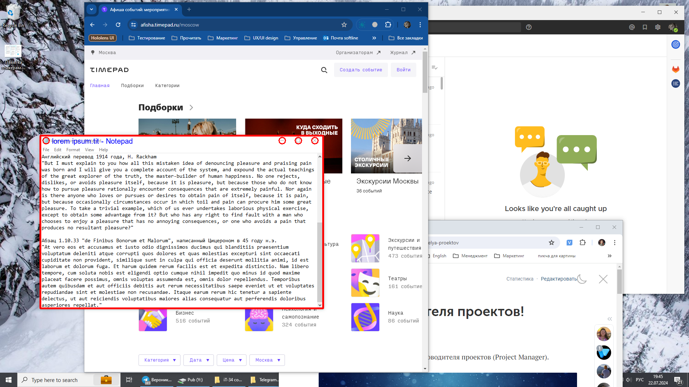
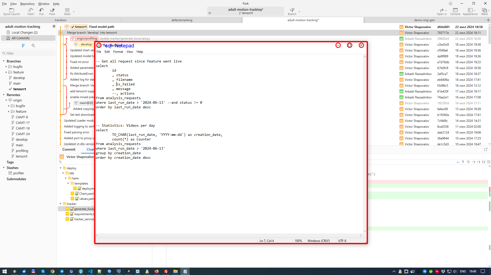

## Prerequisites

Ensure you have the following software installed:

Tesseract OCR ()

## Installation

**1.clone this repository**

```
git clone https://github.com/xardonix/notepad-window-detector
cd notepad-window-detector
```
**2.download dependencies**

```
pip install -r requirements.txt
```

## Usage

```
python notepad_detector.py --image_path {path to image}
```

## Demo




